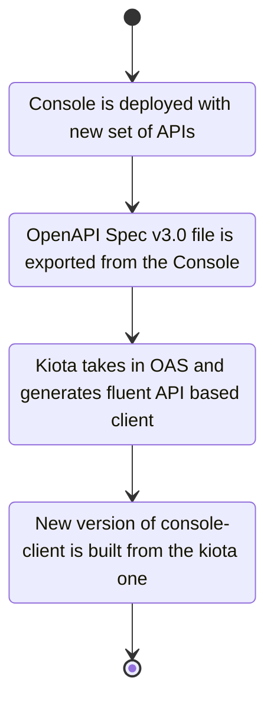

# Console-client

> [!IMPORTANT]  
> Console Client Package is experimental, it may be subject to breaking changes and features only a minimal subset of APIs
>
> Beware this package is currently only bundled as **ES Module**, consider this before using it.

## What is the console-client?

Console-client is the Mia-Platform client library for interacting with the Console APIs.  
This library aims to help you easily interact with Console exposed APIs from your `js`/`ts` application through a fluent API notation.

## How does this library work?

Console client library is autogenerated from the OpenAPI Specification (OAS) of the Console APIs. The tool that makes this possible under the hood is [Kiota][kiota].

The following flow describes how the console-client is generated.



## How to auto generate the client?

To generate the client you just need kiota and an OAS file either `json` or `yaml` will work.

> [!NOTE]
> Currently kiota only supports OAS up to v3.0 thus ensure to export the correct version before proceeding.

There are several ways to get kiota, pick your favorite from the [official documentation][install-kiota].

Once installed kiota, you shall just execute:

```sh
kiota generate -l <language> -d <path-to-oas-file> -o <output-path-for-the-generated-client> -c <name-of-the-client-to-generate>
```

E.g.

```sh
kiota generate -l typescript -d ./oas-schema/console-apis-schema.json -o ./src/kiota-client/ -c ConsoleClient
```

That's it, now you have your client generated!

## Which APIs are exposed from the console-client?

Console has a lot of APIs to communicate with all the underneath services but only a subset of these are considered stable enough to be exposed on the OAS generated from the API Portal.

Even though all of these are considered stable and breaking changes cannot be made by design, just a subset of these are exposed from the console-client.  
For the moment only domain-centered APIs will be put in the console-client.

For this reason it's not currently possible to generate the client in a fully-automated way.
A manual step is required in order to filter just the correct API set from the exported OpenAPI Spec file.

<!-- link aliases below -->
[kiota]: https://github.com/microsoft/kiota
[install-kiota]: https://learn.microsoft.com/openapi/kiota/install
